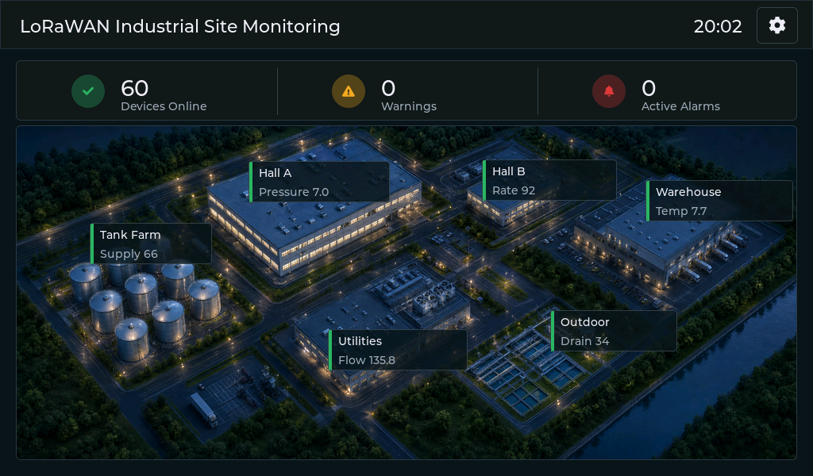
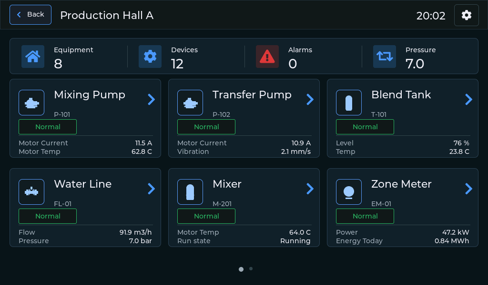
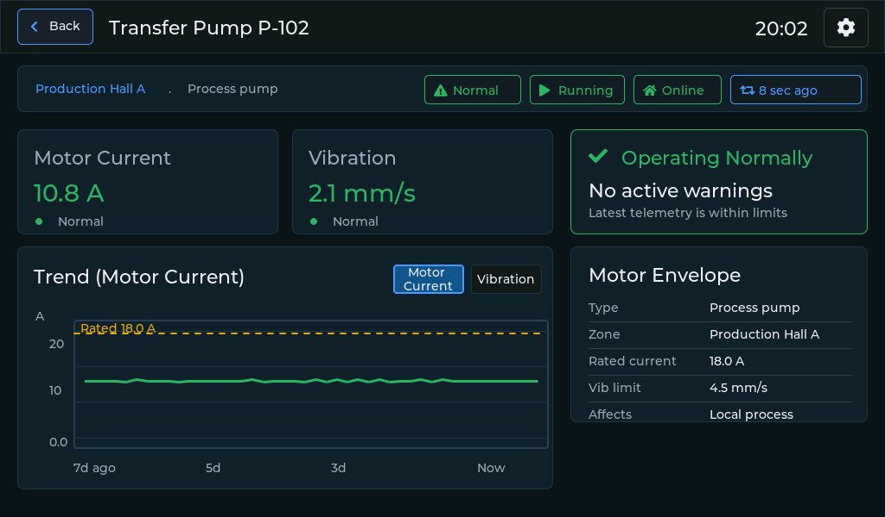

# LoRaWAN Industrial Site Monitoring Demo

Industrial HMI demonstration for **Elecrow CrowPanel ESP32-P4 panels**. It presents a beverage production and bottling plant with 60 LoRaWAN devices distributed across six connected production areas.

The package includes a ready-to-use Windows flashing tool for hardware revision **V1.2**.

## Download

[Download the ready-to-use Windows package](./CrowPanel_P4_flasher.zip)

## Requirements

- Elecrow CrowPanel ESP32-P4, hardware revision **V1.2**;
- a Windows computer;
- a data-capable USB-C cable.

## Flashing

1. Download `CrowPanel_P4_flasher.zip` from the link above.
2. Fully extract the ZIP archive. Do not run the flashing tool directly from inside the archive.
3. Connect the panel's **UART0 USB-C port** to the Windows computer using a data-capable USB cable.
4. Open the extracted `CrowPanel_P4_flasher` folder.
5. Run `CrowPanel_P4_flasher.exe`.
6. Select the panel's COM port. Click **Refresh** if the port is not listed.
7. Make sure **Clean install (erase entire flash)** is enabled.
8. Click **Flash panel**.
9. Do not disconnect or power off the panel while flashing.
10. Wait for the **Firmware installed successfully** message.

The panel restarts automatically after flashing.

## Using the HMI

After startup, the panel displays a looping three-screen presentation. **Press and hold anywhere on the screen for 3 seconds** to open the HMI.

### Site Overview

The main screen shows all six production areas, online devices, warnings, and active alarms.

1. Tap an area on the site map to open its equipment overview.
2. Tap an equipment card to open measurements, communication status, warnings, and trends.
3. Use **Back** to return to the previous screen.

### Demo Scenarios

Tap **DEMO** in the top bar.

- Select **Auto** to run the continuous plant simulation.
- Select **Manual** and choose a scenario to start a guided fault demonstration.
- Follow the highlighted area and equipment to see how the fault propagates through the plant.
- On the root-cause equipment screen, tap **Recover Root Cause** to complete the scenario.

### Settings

Tap the settings button in the upper-right corner. You can configure:

- Wi-Fi;
- time format and synchronization;
- display brightness;
- presentation return timeout.

After the configured period without touch input, the application returns to the presentation automatically. You can also press and hold anywhere in the HMI for 3 seconds to return immediately.

## USB-C Ports and Power

CrowPanel ESP32-P4 panels have two USB-C ports:

- **UART0** — used for firmware flashing and serial communication;
- **USB 2.0** — native USB port that can also provide additional 5V power.

Use **UART0** as the main connection for flashing.

If the display goes black or the panel restarts during operation, connect a second USB-C cable to **USB 2.0** for additional power. If the panel operates reliably with one cable, the second cable is not required.

## Troubleshooting

### The panel is not detected

- Make sure the cable is connected to **UART0**, not USB 2.0.
- Use a USB cable that supports data transfer.
- Close any serial monitor or other application using the COM port.
- Reconnect the panel and click **Refresh** in the flashing tool.

### Flashing fails

- Confirm that the panel is hardware revision **V1.2**.
- Enable **Clean install (erase entire flash)** and try again.
- Reconnect the panel directly to the computer without a USB hub.
- Try another data-capable USB cable or USB port.

### The application stays on the presentation screens

This is the normal startup mode. Press and hold anywhere on the screen for **3 seconds** to open the HMI.

### The panel resets or the display goes black

Connect the second USB-C port, **USB 2.0**, to an additional 5V power source.
