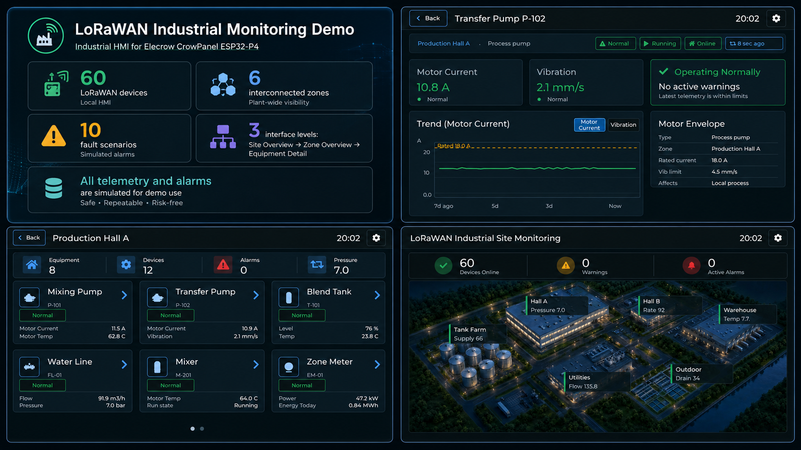
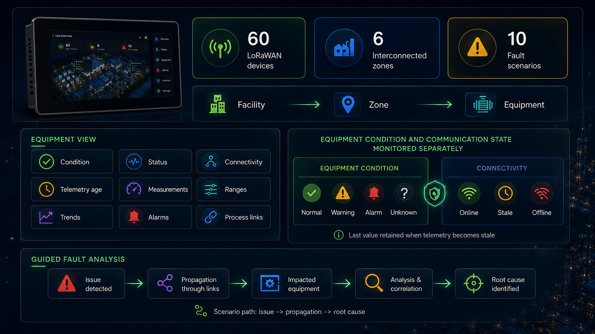
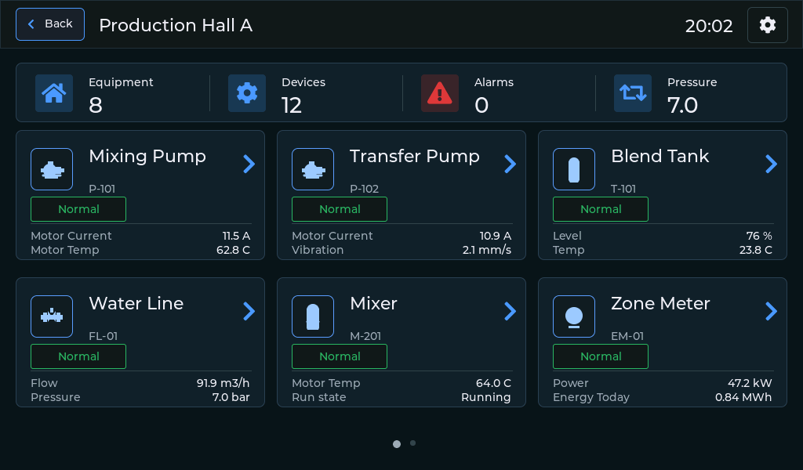
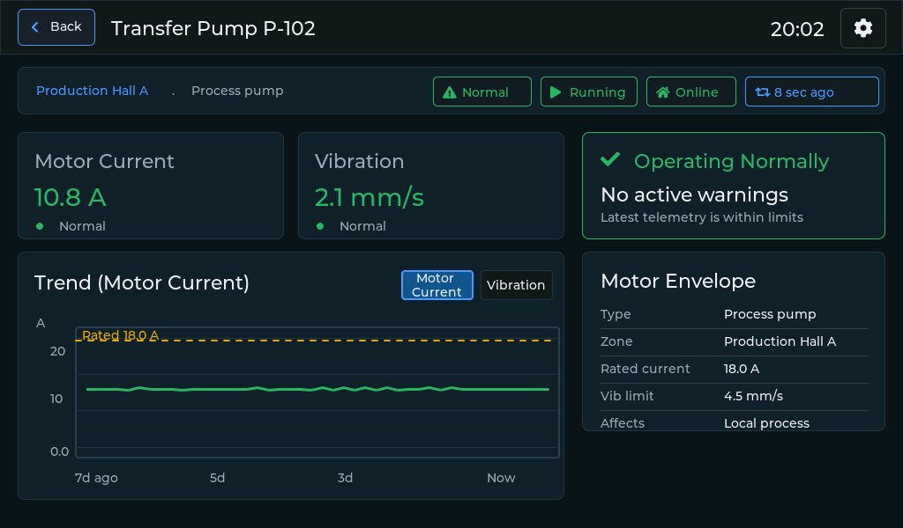
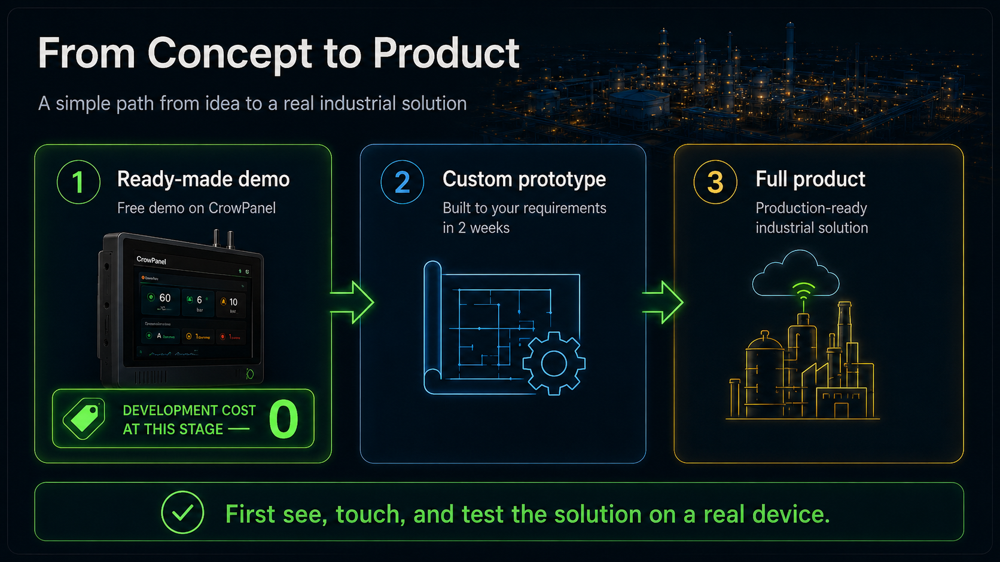

# LoRaWAN Site Monitoring HMI

**Monitor LoRaWAN devices, sensor data, communication status, alarms and trends.**

## Demo

A demo application for Elecrow CrowPanel ESP32-P4 - an industrial HMI for local monitoring of LoRaWAN infrastructure.

The prototype models a beverage production and bottling facility: 60 LoRaWAN devices are distributed across 6 interconnected production zones.

On the main screen, the operator sees the entire facility, the number of available devices, warnings, and active alarms. From the overall view, the operator can open a specific production zone and then drill down to an individual piece of equipment.

For each piece of equipment, the interface displays:

- current condition;
- operating status;
- connectivity status;
- time since the last telemetry update;
- current measurements;
- operating ranges;
- parameter trend charts;
- active alarms;
- links to other elements of the process.

Equipment condition and connectivity are monitored separately. For example, loss of communication with a sensor does not automatically mean that the equipment has stopped: the HMI retains the last received value and indicates that the telemetry is stale.

The application also includes 10 fault scenarios: low raw-material level, pump degradation, flow restriction, incorrect valve position, telemetry loss, cooling-system overload, unstable mixing, packaging-line shutdown, an open cold-storage door, and drainage-pump failure.

During a scenario, the system shows how the fault propagates through connected areas and equipment and guides the user to the root cause.

The HMI is organized in three main levels: Site Overview → Zone Overview → Equipment Detail. This structure lets the operator move from the overall plant status to a specific production area and then to an individual device without losing process context.

### Site Overview

The main screen shows the entire facility as a set of connected production areas.

The operator can immediately see:

- the status of each area;
- the number of devices in each area;
- active warnings and alarms;
- overall LoRaWAN device availability;
- where attention is currently required.

Each production area is selectable and opens its own detailed view.

### Zone Overview

Each production area has its own screen containing the equipment assigned to that part of the process.

The screen combines the physical process structure with the current state of individual devices. Equipment is not presented as a flat list of LoRaWAN endpoints — it remains connected to its role within the production process.

For each item, the operator can see its current condition and move directly to the detailed equipment view.

This level makes it possible to identify whether a problem is limited to one device or affects a larger part of the process.

### Equipment Detail

The equipment screen provides the most detailed view of an individual monitored asset.

It includes:

- equipment operating state;
- LoRaWAN communication state;
- time since the latest telemetry update;
- current measurements;
- expected operating ranges;
- historical trends;
- active warnings and alarms;
- relationships with other equipment in the process.

One important detail is that equipment health and communication health are handled separately.

An equipment item may remain in a normal operating state while its LoRaWAN connection becomes stale or offline. The HMI keeps the last received value visible and clearly indicates that the telemetry is no longer current.

This prevents communication loss from being interpreted automatically as equipment failure.

### Telemetry and Trends

Current values are shown together with their operating ranges and recent history.

This makes the interface useful not only for detecting an alarm, but also for understanding how the parameter reached that state.

Instead of seeing only a single number, the operator can compare:

- the current value;
- the normal operating range;
- recent trend behavior;
- the age of the latest telemetry.

### Fault Scenarios and Root Cause

The prototype includes 10 predefined fault scenarios that can be triggered directly on the panel.

These scenarios include:

- low raw material level;
- pump degradation;
- flow restriction;
- incorrect valve position;
- telemetry loss;
- cooling overload;
- unstable mixing;
- packaging line stoppage;
- cold-storage door left open;
- drainage pump failure.

The scenarios are designed to show how a fault can affect several connected parts of the process.

Instead of presenting isolated alarms, the HMI shows the relationship between affected equipment and allows the user to follow the problem through the process until the underlying cause becomes clear.

This is one of the key parts of the prototype: it demonstrates how LoRaWAN telemetry can be turned into process-level operational information, rather than simply displayed as a collection of sensor values.

## Firmware

Download the firmware, flash your CrowPanel, and run the demo:

**[Download CrowPanel_P4_flasher.zip](https://github.com/Grovety/LoRaWAN-Industrial/blob/main/CrowPanel_P4_flasher.zip)**

After startup, a short presentation is shown first, then the HMI opens with a running simulation of a beverage production and bottling facility with 60 LoRaWAN devices across 6 interconnected production zones.

## Customization - Build Your Own HMI

This is a concept prototype, not a production-ready system for deployment at an industrial facility.

All 60 devices, telemetry, and fault conditions are simulated by the application. This means you do not need to deploy a real LoRaWAN network or connect dozens of physical sensors to demonstrate the concept.

The solution can be adapted to:

- your equipment and system structure;
- your data and control commands;
- UI and branding;
- alarms and operating scenarios;
- OPC UA and other required integrations;
- CrowPanel hardware configuration.

### First Step: See the Demo in Action

Buy a CrowPanel, install the free demo prototype, and evaluate the concept.

**Development cost at this stage - 0.**

You get a physical example of the solution that you can evaluate yourself or use for an internal project presentation.

### Next Step: Order a Prototype for Your Use Case

If this approach fits your project, the next step is to create a similar prototype based on your requirements.

**Within 2 weeks**, we can prepare a version with:

- your facility structure;
- your equipment and sensor types;
- your parameters and operating ranges;
- your warning and alarm logic;
- your user scenarios;
- an interface close to the future product.

You can use this prototype for technical concept validation, demonstrations to customers or management, and to make a decision on full-scale development.

### Final Step: Move to a Full Product

After validating the prototype, you can move on to a production solution.

This can include:

- integration with real LoRaWAN devices and existing infrastructure;
- receiving and processing real telemetry;
- handling alarms, warnings, and events;
- equipment control;
- development of a full HMI;
- integration with the server side;
- preparing the solution for real-world deployment.

## Need a Similar HMI for Your Product?

Discuss your project with Elecrow.

We can customize the hardware and software for your application.

**[Discuss Your Project](mailto:hi@grovety.com)**
